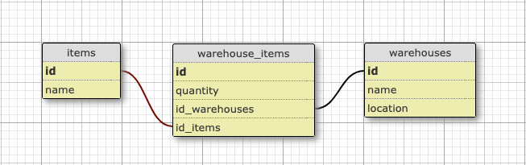

# Inventory App
A rails web app to manage inventory items in multiple warehouses. Main features in this app are the CRUD actions for `Item` and `Warehouse` and add Items in different Warehouses.

## Features
- CRUD for `Item` model
- CRUD for `Warehouse` model
- Add Items in different Warehouses with a custom quantity

## Installation

### Replit
[Replit repo](https://replit.com/@RabihMteyrek/inventory-app/), to run just click the green run button at the top.

### Locally
1. Clone repo
2. Run `bundle install` to install dependencies
3. Run `rails db:migrate` to generate the database
4. Run `rails s` to run the server

A server should now be running on `http://localhost:3000`

## Database
Database consists of three tables, two model table and one joint model table.

## App Pages
| Path             | Description                                                       |
| :--------------- | :---------------------------------------------------------------- |
| `/`              | **Root path**                                                     |
| `/items`         | **Display all items**, add, edit and delete.                      |
| `/items/:id`     | **Show specific item**, with location in different warehouses.    |
| `/warehouses`    | **Show all warehouses**, add, edit and delete.                    |
| `/warehouses/:id`| **Show specific warehouse**, add item with quantity to warehouse. |
